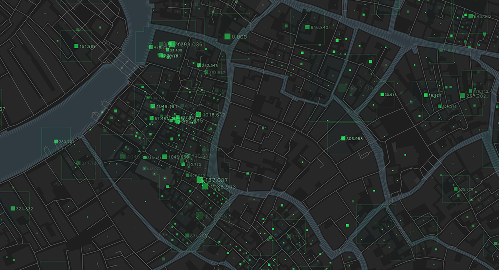

# interactive-visualizations
Dashboards made with Plotly

# :earth_americas: Geospatial Visualizations

### :green_book: Description
This repository shows an interactive visualization of climate data made with Plotly.

---
### :computer: Tools
`Python` `Pandas` `NumPy` `SQL with Python` `Plotly`

---
### :page_with_curl: Credits
- [Photo](https://intellias.com/development-platform-for-geospatial-services-and-big-data/)

---
### :closed_lock_with_key: License
:copyright: Samuel McGuire, Malte Bonart\
\
The material used in this repository is from _**Spiced Academy**_, licensed under a [Creative Commons Attribution-ShareAlike 4.0 International License](https://creativecommons.org/licenses/by-sa/4.0/).

All data has been used only for educational purposes.
